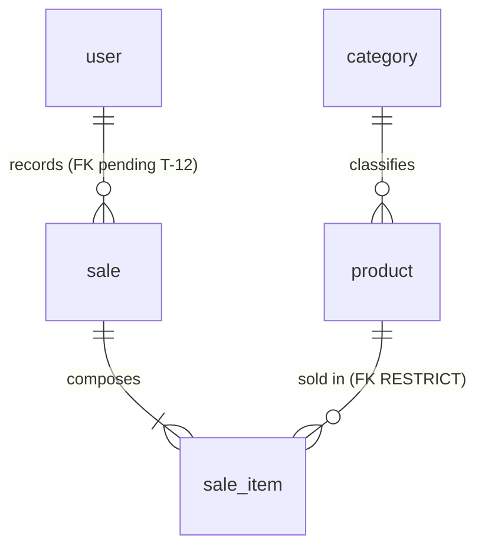

# Data Model — Simple Stock Flow

**The single place where the data model lives.** Whoever implements this does not need to open the
code or connect to the engine to know what's there, of what type, under what rule, and **where
that rule actually lives today**.

- **Date:** 2026-09-19
- **Verified against:** PostgreSQL 16.14 (`simple-stock-flow-db-1`), database `simple_stock_flow`,
  schema `sales`, server in UTC. The queries and their literal output are in [§10](#10-how-this-document-is-checked-for-lying).
- **Governed by:** [`constitution.md`](constitution.md) (non-negotiable) and [`spec.md`](spec.md)
  (what and why). Technical decisions D-01…D-10 are in [`plan.md`](plan.md) §1; the shape of the
  system, in [`architecture.md`](architecture.md); the four structural decisions, in
  [`adr/`](adr/).
- **`plan.md` no longer describes the schema.** Its §2 and §3 link here. If anything there
  contradicts this document, this document wins; if this document contradicts the engine, **the
  engine wins** (article X) and the document is broken.

---

## How to read this document

Every model rule carries a mark, and **there are only three**:

| Mark | Means |
|---|---|
| **engine** | Exists in Postgres right now. A manual `INSERT` respects it or fails |
| **domain only** | Guaranteed by C# and nothing else. **An `INSERT` via `psql` skips it silently** |
| **pending (T-xx)** | Doesn't exist yet. That task in [`tasks.md`](tasks.md) will add it |

**Why the third column is the heart of the document.** An invariant that only lives in C#
protects the application, not the data: any `psql`, any migration, and any future service skips
it without noticing. [ADR-002](adr/adr-002-optimistic-concurrency.md) already set the criterion
for `stock >= 0` —*if the constraint trips, something wrote outside the adapter*— and that
criterion holds for **all** invariants expressible in the engine. What isn't enforced is declared
pending; it isn't promised.

---

## 0. Schema naming convention

**The five tables are singular.** That's what the governance's convention table mandates, and the
project aligns with it:

| Element | Convention | Example |
|---|---|---|
| Entity | `PascalCase`, English, **singular**, ASCII | `SaleItem` |
| Attribute | `snake_case`, English, **singular**, ASCII | `unit_price` |
| List attribute | **Never plural** | `sale_item`, not `sale_items` |

Translating to schema is direct: `category`, `product`, `sale`, `sale_item`, `user`. **What goes
singular is the table; the schema keeps being called `sales`**, so the qualified form of the sales
aggregate is `sales.sale`.

**The singular doesn't reach object code, and that's not an exception but the boundary.** Domain
class names (`Product`, `Sale`, `SaleItem`, `User`, `Category`) were already singular and correct;
C# collections (`Sale.Items`, `DbSet<Product> Products`) **stay plural** because they name sets of
objects, not tables. Translating from one to the other is the persistence adapter's job, which is
exactly where the mapping belongs.

**`user` doesn't require quoting, and it's verified.** Postgres treats `user` as a keyword **only
when unqualified**; as soon as the name has a schema in front of it, it reads it as an identifier:

```sql
create table sales."user"(id int);
select * from sales.user;   -- works, WITHOUT quotes
```

Every query in this project is prefixed with `sales.`, so the problem never arises —and EF quotes
on its own anyway—. **The reason is that the schema qualifies it, not that the name is plural**:
any document giving the other reason is wrong, even if it reaches the right conclusion.

**Writing and viewing aren't the same thing, and it's worth not confusing them.** Postgres does
**not require** quotes when writing, but it **does print** them when rendering the identifier on
its own: in §10.2 and §10.3 the table shows up as `sales."user"`, not `sales.user`. That's catalog
cosmetics, not a syntax requirement, and no query in this project ever needs to quote it.

> The other axis of the convention —which names EF generates and which are written by hand— is in
> [§3.1](#31-naming-convention--today-two-styles-coexist).

---

## 1. Domain glossary

In business language. Code and column names are in English (article XI); the technical column
shows where each term lives.

| Term (business) | Functional definition | Where it lives (technical) |
|---|---|---|
| **Product** | Catalog item. Has **name, price, stock, category and optional image, and nothing else** (DP-03) | `Product` · table `product` |
| **Category** | Classification a product belongs to. **Fixed set of five**, seeded, no maintenance (D-10) | `Category` · table `category` |
| **Price** | Current monetary value of the product in the catalog. Strictly positive | `Money` (value object) · column `product.price` |
| **Stock** | Units of the product available. Never negative | `product.stock` |
| **Product image** | **Opaque key** of the binary in external storage. Neither the binary nor a path (D-08). Absence is represented as `NULL`, never as an empty string | `product.image_key` |
| **Sale** | Consummated, **immutable** commercial fact: who, when, and what. Once recorded it is neither edited nor deleted | `Sale` · table `sale` |
| **Sale line** | Row of the sale: product, quantity and the **frozen price** at the time. Doesn't exist outside its sale | `SaleItem` · table `sale_item` |
| **Quantity** | Units sold in a line. Strictly positive | `Quantity` (value object) · `sale_item.quantity` |
| **Sale total** | Sum of subtotals. **Computed, not stored** (article VII) | `Sale.Total` · **no column** |
| **Line subtotal** | Unit price times quantity. **Computed, not stored** | `SaleItem.Subtotal` · **no column** |
| **User** | Internal operator who authenticates and records sales. **There is no customer or buyer entity** | `User` · table `user` |
| **Role** | User's attribution within a closed set of two: `admin` or `seller` | `user.role` |
| **Password hash** | Irreversible fingerprint of the password. The domain **never sees the plaintext password** (D-09) | `user.password_hash` |
| **Date range** | Report's time window. The end cannot precede the start | Value object of the application layer · **no table** |
| **Sales report** | Aggregation by product over a range. **Not persisted**: computed in the engine by a read port (D-06) | Read model · **no table** |

**Frozen value.** When this document says a value is *frozen*, it means the sale line stores a
**copy of the value at the moment of the sale** and that copy does not follow the catalog. This is
not denormalization: the selling price and the sold name are **facts of the sale itself**, not
product attributes read late. It's what lets a product be renamed or repriced without rewriting
reports for closed periods.

**Adapted from the recovered document, with two corrections.** The recovered document's glossary
at `data/data-model.md` §2 included *sale currency* as a term; **the system is single-currency by
construction** (D-05) and there is no currency column in any table. And its definition of Product
left the door open to additional attributes; **DP-03 closes it**: name, price, stock, category and
image. No description, no SKU, no reference code.

---

## 2. The five entities and their invariants

**Five entities, five tables, no surplus.** There's no report table, no audit table, no counters
table, and no tables for value objects —which have no identity and live inside their owner's row
(D-07)—.



### 2.1 `Category` — reference entity

| Invariant | Who enforces it | Mark |
|---|---|---|
| Name required and non-empty; stored trimmed | `Category.Rename` | **domain only** · lowered to the engine in T-20 |
| Name unique | Unique index `IX_category_name` | **engine** |

**Not an aggregate root and has no lifecycle.** Its repository is **read-only**: no port creates,
renames or deletes categories. The five rows are born in the initial migration ([§9](#9-seed-strategy)).

### 2.2 `Product` — aggregate root (catalog)

| Invariant | Who enforces it | Mark |
|---|---|---|
| Name required and non-empty; stored trimmed | `Product.Rename` | **domain only** (`NOT NULL` is in the engine; *non-empty* is not) |
| `price > 0` | `Product.ChangePrice` | **domain only** · T-20 |
| `stock >= 0` after any operation | `Product.Withdraw` / `Product.Restock` | **engine** — `ck_product_stock_non_negative`, ADR-002's last line of defense |
| Withdrawing more stock than available fails | `Product.Withdraw` | **domain only** — it's a process rule, not expressible as a `CHECK` |
| Category required and existing | `Product.SetCategory` + `FK_product_category_category_id` | **engine** |
| `image_key` absent ⇒ `NULL`, never empty string | `Product.AttachImage` normalizes blank to `null` | **domain only** · *there is no* equivalent pending rule: `NULL` is the only representation and `image_key IS NULL` is enough |
| Never physically deleted: soft delete | Shadow property `deleted_at` + global filter | **engine** since T-09 · the column exists and the global filter applies it — see [ADR-003](adr/adr-003-soft-delete.md) |

**`Money` allows a zero amount, and this matters.** Its constructor rejects only negatives, so
`new Money(0)` is valid. The only guard on `price > 0` is `Product.ChangePrice`: a product priced
at 0 inserted via `psql` passes today. That's exactly the gap T-20's `CHECK` closes.

**The rounding rule lives in `Money`, not in the column.** `Money` rounds to **2 decimal places
with `MidpointRounding.AwayFromZero`** before saving; the column is `numeric(18,2)`. They match by
construction, not by coincidence. **If one changes, the other changes in the same migration**:
with more decimals in the column the extra precision would always be zero, and with more decimals
in `Money` the engine would truncate on its own and the amount read would no longer match what was
written.

### 2.3 `Sale` — aggregate root (sales)

| Invariant | Who enforces it | Mark |
|---|---|---|
| Records who made it; required and non-empty | `Sale` constructor | **domain only** (`NOT NULL` is in the engine) |
| **At least one line** to be confirmable | `Sale.EnsureConfirmable` | **domain only** — not expressible as a `CHECK`; would require a deferred trigger |
| **A product doesn't repeat** within the same sale | `Sale.AddItem` rejects the duplicate | **domain only** *and now also* **engine**: the unique index `(sale_id, product_id)` has existed since T-20, with `INCLUDE (quantity, unit_price)` |
| Deducting stock and adding the line are **a single operation** | `Sale.AddItem` calls `Product.Withdraw` before adding | **domain only** — it's the rule that gives the aggregate its meaning |
| Immutable once recorded | No edit or delete port exists | **domain only** (by absence of operation) |

**The sale doesn't know the currency.** The total is computed by summing subtotals and `Money`
requires matching currency when summing; since the mapping always reconstructs the default
currency, it can't fail today. **The explicit guard in `Sale.AddItem` is cheap debt and has a
task: T-05.**

### 2.4 `SaleItem` — internal entity of the `Sale` aggregate

| Invariant | Who enforces it | Mark |
|---|---|---|
| Product required | `SaleItem` constructor + `NOT NULL` | **engine** · `NOT NULL` and the **FK** `FK_sale_item_product_product_id` with `RESTRICT`, added by T-20 |
| `quantity > 0` | `Quantity` constructor | **domain only** · T-20 |
| Name and price **frozen** at the moment of sale | `Sale.AddItem` copies from `Product` | **domain only**, by construction |
| **Category name frozen** | `SaleItem` constructor + `NOT NULL` | **engine** (T-11) · `sale_item.category_name`, deliberately with no foreign key — D-06 and [ADR-004](adr/adr-004-aggregate-frozen-report.md) |
| **Doesn't exist outside its sale** | `FK_sale_item_sale_sale_id ON DELETE CASCADE` | **engine**, entirely: the cascade and the `sale_id NOT NULL` that completes it, added by T-20 |

**Not constructible from outside.** Its constructor is `internal` and only `Sale.AddItem` invokes
it: there's no legitimate way to manufacture a loose line.

### 2.5 `User` — aggregate root (identity)

| Invariant | Who enforces it | Mark |
|---|---|---|
| Username required and **unique** | Constructor + unique index `IX_user_username` | **engine** (uniqueness) |
| Username **lowercase and trimmed** | `User.NormalizeUsername` | **domain only** · T-20 |
| Password hash required and non-empty | `User` constructor | **domain only** (`NOT NULL` is in the engine) |
| `role` in `('admin','seller')` | `Roles.IsValid` | **domain only** · T-20 |
| The domain **never sees the plaintext password** | The hash is produced by a port (D-09) | By hexagon design |

**Why normalization is an invariant and not a convenience.** A lookup that skipped
`NormalizeUsername` would allow registering `"Ana "` as a new account that **could never log in**:
the aggregate would store it as `ana` and collide with the existing one.

---

## 3. Physical model — the 22 columns

Schema `sales` of the `simple_stock_flow` database. **No column has a `DEFAULT`, and that's
deliberate: values are set by the domain**, never by the engine —a default in the engine would be
a second source of truth that nobody tests—. The types are what `information_schema.columns`
returns today; the literal output is in [§10](#10-how-this-document-is-checked-for-lying).

**Tables singular, no exceptions**, per the convention in
[§0](#0-schema-naming-convention). The why and the verification for `user` are there; not repeated
here.

**`category`** — read-only seed data (D-10).

| Column | Type | Nullable | Default | Note |
|---|---|---|---|---|
| `id` | `uuid` | no | none | Primary key. Literal identifiers in the migration, so tests can reference them ([§9](#9-seed-strategy)) |
| `name` | `varchar(120)` | no | none | Unique |

**`product`**

| Column | Type | Nullable | Default | Note |
|---|---|---|---|---|
| `id` | `uuid` | no | none | Primary key |
| `name` | `varchar(200)` | no | none | The domain trims it before saving |
| `price` | `numeric(18,2)` | no | none | Amount only: **no currency column** (D-05). 16 integer digits, plenty for the scope |
| `stock` | `integer` | no | none | |
| `category_id` | `uuid` | no | none | Restrictive foreign key to `category` — [§5](#5-foreign-key-policy) FK-1 |
| `image_key` | `varchar(512)` | **yes** | none | Opaque key, never a path or bytes (D-08) |
| `category_name` | `varchar(120)` | no | none | **engine** (T-11) · the label frozen at the moment of sale. **No foreign key, on purpose**: if it had one, renaming the category would rewrite history, which is exactly what ADR-004 forbids. Same width as `category.name`, and **the two move together** |
| `deleted_at` | `timestamptz` | yes | none | **engine** (T-09, verified against `information_schema`: nullable, no default) · shadow property, no property on the aggregate (D-03). Null while the product is active: that's what makes it serve as a predicate for partial indexes |
| `xmin` | `xid` | — | — | **System column of the engine**, not of the schema. Postgres increments it on every `UPDATE`. It's D-04's concurrency witness, exposed as a shadow property (T-10). **It doesn't appear in `information_schema` because it's not a declared column**, so it doesn't count among the 21 |

**`sale`** — the `sales` schema groups the entire system; the `sale` table names the aggregate.
**The singular undoes a collision that existed**: before the rename there was a `sales` table
inside the `sales` schema and the qualification was `sales.sales`. Today it's `sales.sale`, and the
prefix doesn't change: **what goes singular is the table, never the schema**.

| Column | Type | Nullable | Default | Note |
|---|---|---|---|---|
| `id` | `uuid` | no | none | Primary key |
| `sold_at` | `timestamptz` | no | none | Moment of the sale. **It's the system's only business instant** ([§8](#8-audit-created_at--updated_at)) |
| `sold_by` | `varchar(120)` | no | none | **Called this today.** Renamed to `sold_by_username` in **T-12** (see note below) |
| `sold_by_user_id` | `uuid` | no | none | **pending (T-12)** · restrictive foreign key to `user.id` — FK-4 |

**`sale_item`**

| Column | Type | Nullable | Default | Note |
|---|---|---|---|---|
| `id` | `uuid` | no | none | Primary key |
| `product_id` | `uuid` | no | none | **No foreign key today** — FK-3, [§5](#5-foreign-key-policy) |
| `product_name` | `varchar(200)` | no | none | Frozen copy of `product.name`, **same length on purpose** |
| `quantity` | `integer` | no | none | |
| `unit_price` | `numeric(18,2)` | no | none | Frozen copy of the price. **A single column**: no `unit_price_currency` (D-05) |
| `sale_id` | `uuid` | **yes — a defect** | none | Must become `NOT NULL`: a line without a sale means nothing, contradicts the cascade already configured, and leaves the unique composite useless. Cause: `HasForeignKey("sale_id")` creates a shadow property and EF makes it nullable if the relationship doesn't declare `IsRequired()` |
| `category_name` | `varchar(120)` | no | none | **pending (T-11)** · same length as `category.name` because it's a frozen copy of that value (D-06). `NOT NULL` **is free today because the table is empty**; it stops being free with the first sale, and then the migration needs a backfill |

**`user`**

| Column | Type | Nullable | Default | Note |
|---|---|---|---|---|
| `id` | `uuid` | no | none | Primary key |
| `username` | `varchar(120)` | no | none | Unique. Stored lowercase and trimmed |
| `password_hash` | `varchar(512)` | no | none | **Never indexed** ([§7](#7-privacy-and-retention)) |
| `role` | `varchar(40)` | no | none | Closed set: `admin`, `seller` |

**Two cross-cutting rules, written so nobody has to infer them.**

1. **No currency column in any table: the system is single-currency** (D-05). Not reintroduced.
2. **All timestamps are `timestamptz`, without exception.** The server runs in UTC. Whoever adds a
   new date column doesn't have to infer it from `sold_at`.

**On `sold_by`'s two names.** The column is called `sold_by` in the engine and `Sale.SoldBy` in the
domain. **The code is aligned to the long name, not the other way around**, because as soon as
T-12 adds `sold_by_user_id` alongside it, plain `sold_by` won't say which of the two it is. The
rename **doesn't touch the API contract** —the field that travels is `SaleView.SoldBy` and doesn't
change— and it's cheap now because the table is empty.

### 3.1 Naming convention — today two styles coexist

What EF generates keeps its style: `PK_`, `IX_`, `FK_`, in `PascalCase` and quoted. What's written
by hand —which today is **only the `CHECK`s**— goes in `snake_case` with the pattern
`ck_{table}_{rule}`, like the existing `ck_product_stock_non_negative`. **The two conventions are
deliberate:** renaming what EF generates would force keeping a parallel name list in every
migration.

**Derived names follow the table.** When tables moved to singular ([§0](#0-schema-naming-convention)),
EF regenerated its own —`PK_product`, `IX_category_name`, `FK_sale_item_sale_sale_id`— with no one
writing them. **The only one that has to be renamed by hand is the `CHECK`**, precisely because EF
doesn't generate it: `ck_products_stock_non_negative` became `ck_product_stock_non_negative`.
Leaving it with the old name would have been the only object in the schema left in plural.

### 3.2 Applied migrations

Four, not one. The schema is owned by the EF migrations **and nothing else** ([ADR-001](adr/adr-001-schema-ownership.md)).

| Migration | What it does | Task |
|---|---|---|
| `20260919175513_InitialSchema` | The five tables, the two foreign keys, the unique and access indexes, and **the five seed categories included** | T-02 |
| `20260919194003_StockNonNegative` | The schema's only `CHECK` | T-10 |
| `20260919203018_AccentSeedCategoryNames` | Fixes the accent of a seeded category: *Fontaneria* → *Fontanería* | T-02 |
| `20260919215344_RenameTablesToSingular` | The five tables move to singular ([§0](#0-schema-naming-convention)). Along with them, the names EF derives —primary keys, indexes and foreign keys— and, **by hand, the only `CHECK`**: `ck_products_stock_non_negative` → `ck_product_stock_non_negative`. **No column is renamed** | T-02 |

**The rename is a migration, not a document touch-up.** It travels the same path as all the
system's DDL —ADR-001 allows no other— and was applied with `product`, `sale` and `sale_item`
**empty**, `category` with 5 rows and `user` with 1: an instantaneous `ALTER TABLE ... RENAME TO`.
With the first real sale it would still be possible, but no longer free.

The history lives in `public."__EFMigrationsHistory"` —**outside the `sales` schema**, which is why
the column query returns 21 and not more—.

---

## 4. Constraints and indexes: where each rule lives

**Today the schema has eight constraints: five primary keys, two foreign keys and a single
`CHECK`.** The two uniqueness rules (`category.name`, `user.username`) are enforced by the engine
via a **unique index**, not a constraint, so they don't show up in `pg_constraint` but **they are
enforced**. Everything else is domain or pending.

| Rule | Object in the engine | Where it lives today |
|---|---|---|
| Primary key of the 5 tables | `PK_category`, `PK_product`, `PK_sale`, `PK_sale_item`, `PK_user` | **engine** |
| `category.name` unique | `IX_category_name` (unique index) | **engine** |
| `user.username` unique | `IX_user_username` (unique index) | **engine** |
| `product.category_id` → `category.id`, `ON DELETE RESTRICT` | `FK_product_category_category_id` | **engine** |
| `sale_item.sale_id` → `sale.id`, `ON DELETE CASCADE` | `FK_sale_item_sale_sale_id` | **engine** |
| `product.stock >= 0` | `ck_product_stock_non_negative` | **engine** — ADR-002's last line of defense |
| `product.price > 0` | — | **domain only** · `Product.ChangePrice`. Lowering it to the engine is **T-20**. See `Money` in [§2.2](#22-product--aggregate-root-catalog) |
| `sale_item.quantity > 0` | — | **domain only** · `Quantity` constructor. Lowering it to the engine is **T-20** |
| `category.name` non-empty | — | **domain only** · `Category.Rename`. Lowering it to the engine is **T-20** |
| `user.role` in `('admin','seller')` | — | **domain only** · `Roles.IsValid`. Lowering it to the engine is **T-20** |
| `user.username` lowercase | — | **domain only** · `User.NormalizeUsername`. Lowering it to the engine is **T-20** |
| `sale_item.sale_id NOT NULL` | `sale_item.sale_id` | **engine** (T-20) · was the prerequisite for the unique composite, which is why it came first |
| Unique `(sale_id, product_id)` | `IX_sale_item_sale_id_product_id` | **engine** (T-20) · **can't do its job while `sale_id` allows nulls:** in a unique index every `NULL` is distinct from any other, so two lines with `sale_id` null and the same product coexist without complaint |
| `sale_item.product_id` → `product.id`, `ON DELETE RESTRICT` | `FK_sale_item_product_product_id` | **engine** (T-20) · **Not a new decision: ADR-003 already relies on it** as a *last-resort barrier so a manual delete fails loudly*. Never implemented, and today `sale_item` has **no** foreign key to the catalog |
| `sale.sold_by_user_id` → `user.id`, `ON DELETE RESTRICT` | — | **pending (T-12)** · the authorship of a sale can't be left orphaned |
| Access indexes (`product`, `sale`, `sale_item`) | see [§6.2](#62-indexes-what-exists-and-what-is-missing) | Three exist, three are missing — **§6.2 breaks them down one by one** |

**Lowering the five invariants marked *domain only* to the engine is this document's concrete
debt, and it has a task: T-20.** It doesn't change a single line of domain code: it's five `CHECK`s
and one index. What changes is that they stop depending on everyone going through the adapter.

### 4.1 Accents and case in `category.name`: uniqueness stays case/accent sensitive

*Fontanería* and *Fontaneria* are two valid rows, and so are *Pinturas* and *pinturas*. **Accepted
knowingly and on record, not by oversight:** the five categories are read-only seed data, there's
no category CRUD and no port creates them, so **nobody can trigger the collision through the
interface**. The alternative —`citext`, or a unique index over `unaccent(lower(name))`— adds an
extension to the deployment to protect a table nobody writes to.

**Explicit review condition: if category maintenance is ever opened up, this decision is revisited
before that CRUD is written.**

---

## 5. Foreign key policy

**Four relationships, four planned foreign keys. Two exist today.** This table is the full
policy: each one's `ON DELETE`, its `ON UPDATE`, and **why**.

| # | Foreign key | Reference | `ON DELETE` | `ON UPDATE` | State | Why that action |
|---|---|---|---|---|---|---|
| **FK-1** | `product.category_id` | `category.id` | **`RESTRICT`** | `NO ACTION` | **engine** | A category with products isn't deleted. Today it's theoretical —there's no category-delete port— but **the constraint must exist before there is one**, not after |
| **FK-2** | `sale_item.sale_id` | `sale.id` | **`CASCADE`** | `NO ACTION` | **engine** | Pure composition: the line has no life outside its sale. **In practice it never fires**, because sales aren't deleted ([§7.1](#71-retention)). It's there so the model tells the truth about the nature of the relationship, not to be used |
| **FK-3** | `sale_item.product_id` | `product.id` | **`RESTRICT`** | `NO ACTION` | **engine** (T-20) | **Last-resort barrier.** A physical delete must never be able to orphan a sale line or break the report. With ADR-003's soft delete it never fires; it exists so a manual `DELETE` or a future code change **fails loudly** instead of corrupting the history |
| **FK-4** | `sale.sold_by_user_id` | `user.id` | **`RESTRICT`** | `NO ACTION` | **pending (T-12)** | A sale's authorship is accounting data. A user with sales isn't deleted |

**`ON UPDATE NO ACTION` on all four, and it's a decision, not an oversight.** All primary keys are
application-generated UUIDs and **never change**. There's no key-update scenario, so a `CASCADE` on
`UPDATE` would be dead machinery that would hide a bug the day it ever fired. Verified:
`pg_get_constraintdef` prints no `ON UPDATE` clause for the two existing ones, which is how
Postgres represents `NO ACTION` ([§10](#10-how-this-document-is-checked-for-lying)).

**The contradiction this document closes.** [ADR-003](adr/adr-003-soft-delete.md) reasons about
FK-3 as though it existed —calling it a last-resort barrier— and **it was never implemented**.
Until today no document in `simple-stock-flow-docs` said so. Now it's stated, with its mark and its
task.

**Cardinalities and nature of each relationship:**

| Origin | Destination | Cardinality | Nature | Business rule |
|---|---|---|---|---|
| `category` | `product` | 1:N | Aggregate crossing, by root identity | Every product belongs to **exactly one** category, and it's required. A category can exist with no products |
| `sale` | `sale_item` | 1:N | **Internal to the aggregate** (composition) | A persistable sale has **at least one** line. Lines don't exist outside their sale |
| `sale_item` | `product` | N:1 | Aggregate crossing, by root identity | Every line points to an existing product **not soft-deleted at the time of sale** |
| `sale` | `user` | N:1 | Aggregate crossing, by identity | Every sale is attributed to an existing user. Authorship can't be left orphaned |

**N:M relationships: exactly one.** `sale` ↔ `product`, resolved by the associative entity
`sale_item`, which carries its own data (`quantity`, `unit_price`, `product_name` and, with T-11,
`category_name`). **No other bridge table is introduced.** `user` ↔ `role` is **not** N:M: it's a
single value per user within a closed set of two.

---

## 6. Access patterns and indexes

> An index exists because a specific query needs it. The ones not added **are also justified**:
> an extra index makes every write more expensive forever.

### 6.1 Real access patterns

Derived from the ports, not imagined:

| # | Pattern | Table | Filter | Order | Paged | Frequency |
|---|---|---|---|---|---|---|
| Q1 | Search product | `product` | partial text, category, **active** | name | Yes | **High** |
| Q2 | Product by ID | `product` | primary key | — | No | High |
| Q3 | Products by ID batch | `product` | batch, **active** | — | No | **High** |
| Q4 | List categories | `category` | — | name | No | High |
| Q5 | Category by ID | `category` | primary key | — | No | Medium |
| Q6 | Sale with its lines | `sale` + `sale_item` | key and join | — | No | Medium |
| Q7 | Sales by range | `sale` | date range | date desc | Yes | High |
| Q8 | Sales by range, unpaged | `sale` | range | — | **No** | Low — see below |
| Q9 | **Aggregated report** | `sale` ⋈ `sale_item` | range, grouped by product | amount desc | No | **High. The most expensive** |
| Q10 | User by name | `user` | exact equality | — | No | **High, on every login** |

**Q3 is D-04's point of contention:** it's the read that precedes the stock write. **Q1 and Q7
each imply an extra count query**, because they return the total item count. **Q8 has no
consumer** if the report aggregates in the engine, which is how it should be resolved: it's
redundant, and should be removed from the port rather than left as a trap.

### 6.2 Indexes: what exists and what is missing

**Not five missing, three missing.** `sale (sold_at)` and `sale_item (product_id)` **already
exist** from the initial migration, and so do the two integrity-unique ones. The earlier count
treated them as pending; checking against `pg_indexes` ([§10](#10-how-this-document-is-checked-for-lying))
resolves that in a second.

| Index | Serves | State | Note |
|---|---|---|---|
| `product (category_id, name)` **partial over active** | Q1 | **missing (T-13)** | Replaces `IX_product_category_id` and `IX_product_name`, which exist loose today: **they're replaced, not added to**. The predicate comes free instead of costing a filter. Depends on T-09, which creates the soft-delete column |
| `product (name)` with trigrams, **partial over active** | Q1 | **missing (T-13)** | **No B-tree serves a leading wildcard.** It's the only index whose value depends on volume: **the first to go** if the extension is objected to |
| `sale_item (sale_id, product_id)` **unique, including quantity and amount** | Uniqueness, Q6, **Q9** | **missing (T-13)** | With the two columns included, **the report's aggregation never touches the table**. It's the only deliberate optimization in the design. **Requires `sale_id NOT NULL` first** ([§4](#4-constraints-and-indexes-where-each-rule-lives)): with nulls, uniqueness protects nothing |
| `sale (sold_at)` | Q7, Q9 | **already exists** — `IX_sale_sold_at`, ascending | **And it's fine as is.** See the note on `DESC` right below |
| `sale_item (product_id)` | Q9 and FK-3's check | **already exists** — `IX_sale_item_product_id` | The engine indexes the referenced side, **never the referencing one**. Today it protects a query; the day FK-3 exists, it also protects its check |
| `category (name)` unique · `user (username)` unique | Integrity first, then Q4 and Q10 | **already exist** — `IX_category_name`, `IX_user_username` | Unique indexes, not constraints: that's why they don't show up in `pg_constraint` |
| `sale_item (sale_id)` loose | — | **exists and is redundant** — `IX_sale_item_sale_id` | **Dropped in the same migration that creates the unique composite**, which leaves it redundant. Dropping it is part of T-13, not an optional step |

**On the `DESC` of `sale (sold_at)`: it was cosmetic, and it's worth knowing why.** In a
**single-column** index the sort direction changes nothing: Postgres can scan any B-tree backward
at no extra cost, so an ascending `IX_sale_sold_at` serves `ORDER BY sold_at DESC` just as well.
`DESC` would only be justified on a **composite** index, where directions must match the
`ORDER BY`'s to avoid a sort. **The existing index isn't touched**, and this note stays so nobody
"fixes" it later.

**Who installs `pg_trgm`.** The extension **is not installed**: `SELECT extname FROM pg_extension`
returns only `plpgsql` ([§10](#10-how-this-document-is-checked-for-lying)). It's installed by
**the same EF migration that creates the trigram index**, in the same migration and no other: if
the `CREATE EXTENSION` and the `CREATE INDEX` are split apart, there's an intermediate state where
the index migration fails. **It can't go in `db/init/` or any other infrastructure piece, because
ADR-001 reserves all DDL to the migrations** — the infrastructure repository brings up the engine,
it doesn't define the schema. It's feasible without superuser: `pg_trgm` is a *trusted* extension
in Postgres 16, so the database owner can install it. **T-13 must say so.**

### 6.3 Indexes considered and rejected, and why

| Column | Why **not** |
|---|---|
| `deleted_at` loose (pending T-09) | Two effective states with almost all rows in one. Its place is **inside** the partial predicate, which is where it earns its keep |
| `user.role` | Two-value enum over a table of internal operators. No pattern filters by role |
| `product.stock` | **No pattern filters or orders by stock.** It's always read by ID |
| `sale.sold_by_user_id` (pending, T-12) | No pattern uses it. And the query that would justify it —sales by operator— **crosses personal data**: the index isn't pre-built for a query the business already decided not to run (**DP-02**) |
| `sale_item (sale_id)` loose | **Redundant:** it's already the leading column of the unique index. With the nuance that **it exists today** and must be **dropped** in the migration that creates the composite, not just avoided going forward |
| `product.image_key` | Never appears in a filter. It's an opaque key only read to resolve an address |
| `user.password_hash` | **Never indexed, and it's not a performance matter** ([§7](#7-privacy-and-retention)) |

**Honest caveat about included columns.** Index-only scans require the visibility map to be
current. On a table that **only receives inserts**, automatic maintenance fires rarely, so
recently inserted rows **do** cause a table read until the next sweep. The mitigation is
operational, not a design one.

---

## 7. Privacy and retention

> Classified **attribute by attribute**, not by table. "This table has personal data" doesn't say
> what can go in a log or what can appear in a response.

| Table | Attribute | Classification | Required handling | Retention |
|---|---|---|---|---|
| `user` | `id` | Not sensitive | Opaque identifier | Indefinite |
| `user` | `username` | **Personal data — identifies a person** | Restricted access. Admissible in audit; **not** in anonymous responses or public endpoints | Indefinite, no deletion |
| `user` | `password_hash` | **Authentication secret** (not personal data, and demands more) | **Never** in logs, responses, projections or error messages. **Never indexed.** Its only legitimate read is verification, through the hashing port | No history or versioning |
| `user` | `role` | Internal confidential | Reveals privilege level. Not personal, but not public | Indefinite |
| `sale` | `sold_by` → `sold_by_username` (**T-12**) | **Personal data** | Appears on receipts. Restricted access | **Indefinite. Never deleted or edited** |
| `sale` | `sold_by_user_id` — **doesn't exist yet (T-12)** | **Indirect personal data** | Identifies the operator by reference | Indefinite |
| `sale` | `id`, `sold_at` | Not sensitive | — | Indefinite |
| `sale_item` | all | Not sensitive | Commercial data, not personal | Indefinite, with its sale |
| `product` | all | Not sensitive | `name`, `price`, `stock`, `category_id`, `image_key` — no privacy restriction | **Soft delete, never physical delete** |
| `category` | all | Public | — | No deletion |

**Classification doesn't depend on the column name.** `sold_by` today and `sold_by_username` after
T-12 are **the same personal datum**, before and after the rename.

**Regulatory categories that don't apply, and why.** There are no payments or cards, so no payment
regulations apply; there's no health data. And **there's no end-customer personal data**: the sale
records the **internal operator**, not the buyer. The privacy surface is deliberately small, and
it's worth not expanding it without a requirement.

### 7.1 Retention

| What | Policy | Why |
|---|---|---|
| Sales and their lines | **Never deleted or edited.** Indefinite retention | Accounting record. No operation allows it |
| Products | **Soft delete. Never physical delete** (pending T-09) | The sale line and the report depend on the row |
| Categories and users | No deletion | No port does it. If added for users, it must be restrictive (FK-4): a sale's authorship can't be left orphaned |
| **Image binary** | **Deleted** when the image is replaced or the product is soft-deleted | The **only system data that is actually physically deleted** (D-08) |
| Password hash | Not versioned or kept as history | Keeping them would widen the attack surface with no requirement justifying it |

**Mandatory order when deleting a binary, and why atomicity isn't promised.** First `image_key` is
nulled and the transaction commits; **after that**, the binary is deleted. An orphaned binary is
harmless; a key pointing to a deleted binary is a permanently broken image. Storage doesn't
participate in the database transaction, so *"in the same transaction"* is not achievable and
**is not promised** — the recovered document did promise it, and it was false.

**Anonymization for analytics: not defined, and it's a conscious omission.** There's no external
analytics or export, and the report **doesn't expose personal data**: it aggregates by product,
not by operator. **DP-02 closes this**: the report isn't broken down by seller.

---

## 8. Audit `created_at` / `updated_at`

**Decision: the project does NOT carry audit columns. The question is closed, not open.**

The recovered document proposed them on `category`, `product` and `user`, written by the engine
with `DEFAULT now()` and a `BEFORE UPDATE` trigger. **They don't exist in the built system and
aren't added.** Four reasons, in order of weight:

1. **There's no requirement.** The statement doesn't ask for catalog change tracking. Adding six
   columns and a trigger for nobody is invented scope, which is exactly what this deliverable
   exists to avoid (**DP-03** applies the same criterion to product attributes).
2. **It contradicts the rule that the engine has no defaults.** [§3](#3-physical-model--the-22-columns)
   states, and verifies, that **no column has a `DEFAULT`**: values are set by the domain. A
   `DEFAULT now()` would be the first exception, and a second source of truth no test covers. The
   `BEFORE UPDATE` trigger would also be **the only system logic hidden in the database**.
3. **No port could read them.** The domain wouldn't expose them —that's exactly the point of
   resolving them with shadow properties—, so no query expressible today could sort or filter by
   them. They'd be forensic columns, not functional ones: their only use would be looking at the
   table with `psql`.
4. **The two instants the business actually needs already have a column, and these aren't them.**
   `sale.sold_at` is the moment of the sale —the system's only business instant— and
   `product.deleted_at` (T-09) is the only state transition worth tracking. A `created_at` on
   `sale` would be a duplicate of `sold_at` under another name.

**Owner of the reopening, and condition.** If a real audit requirement appears —a question like
*"who changed this price and when?"*— **the decision returns to the owner**, and it's not solved
with two columns: an `updated_at` says *when* but not *what* or *who*, which is what that question
actually asks. The answer then is a change log, and it's a scope decision, not a schema one.
**Until that question is asked, the system carries no audit columns.**

---

## 9. Seed strategy

Two distinct boundaries, worth not mixing up: **the database seeds the categories; it does not
seed the initial administrator.**

### 9.1 The five categories go in the initial migration

**Not sample data: a hard functional dependency.** The category repository is read-only and a
product's category is required (FK-1), so **without seeded categories not even a product can be
created**, and the statement's CRUD couldn't be exercised.

They go in `InitialSchema` with **fixed, literal identifiers**, so tests and manual checks can
reference them without querying first:

| `id` | `name` |
|---|---|
| `11111111-1111-4111-8111-111111111111` | General |
| `22222222-2222-4222-8222-222222222222` | Tools |
| `33333333-3333-4333-8333-333333333333` | Electrical |
| `44444444-4444-4444-8444-444444444444` | Plumbing |
| `55555555-5555-4555-8555-555555555555` | Paints |

The literals respect the shape of a version-4 UUID (digit `4` in the third group, variant `8` in
the fourth) so no library rejects them when parsing.

### 9.2 The initial administrator is **not** seeded by the database

Their `password_hash` can only be produced by the hashing port, which is **application code**.
Seeding it from SQL would require one of two things, and both are bad:

1. **Reimplementing the hashing algorithm in SQL** — a second implementation of a security
   primitive, which can drift from the first without anyone noticing.
2. **Embedding a precomputed literal hash** — ties the seed to the chosen algorithm and turns a
   credential into a value versioned in the repository, against article IX.

**The application's startup creates it, with environment credentials** (D-09, D-10). Today the
`user` table has exactly **one row**, created that way.

**How far the database's contract goes, stated plainly.** The database guarantees the username is
**unique** and **non-null**, and nothing else: that it's lowercase and that the role belongs to the
closed set are today **domain only** ([§4](#4-constraints-and-indexes-where-each-rule-lives)), and
T-20 lowers them. **The database does not today guarantee a role is valid.**

**And it never guarantees who has the right to grant the `admin` role.** That's authorization
policy, it lives in the API, and **it's broken today**: user signup is anonymous (defect A-1). It's
not a data-model matter, but it's named here because §9.2 is where someone would go looking for it.

---

## 10. How this document is checked for lying

Without this, in two weeks it lies again. **These three queries are what produced the tables in
§3, §4 and §6.2**, and anyone can repeat them:

```bash
cd simple-stock-flow-infra && docker compose exec -T db psql -U simple_stock_flow -d simple_stock_flow
```

**How to read the result.** If the first query returns a column not in §3, or the second returns
more or fewer than eight rows, **the document is broken and the document gets fixed** —article X:
the engine wins—. If a rule marked ***domain only*** appears in the engine, it's already been
lowered and needs reclassifying; if one marked ***engine*** doesn't appear, someone deleted it.

**What schema this output is attached to.** The **already-renamed-to-singular** one
([§0](#0-schema-naming-convention)), with `20260919215344_RenameTablesToSingular` applied
([§3.2](#32-applied-migrations)). If these queries returned plural names
—`products`, `PK_sales`, `ck_products_stock_non_negative`—, what would be missing is applying
that migration. **The rename doesn't change a single count**: it's still 22 columns, 8 constraints
and 12 indexes, with the same types and the same nullability. The only thing that changes is the
names —and, in §10.1 and §10.3, the alphabetical order that comes with them: `sale` now sorts
**before** `sale_item`—.

### 10.1 Columns, types, nullability and defaults — must return **21 rows** and **no defaults**

```sql
SELECT table_name AS tabla, ordinal_position AS n, column_name AS columna,
       CASE data_type
         WHEN 'character varying'        THEN 'varchar(' || character_maximum_length || ')'
         WHEN 'numeric'                  THEN 'numeric(' || numeric_precision || ',' || numeric_scale || ')'
         WHEN 'timestamp with time zone' THEN 'timestamptz'
         ELSE data_type
       END AS tipo,
       is_nullable AS nulable,
       coalesce(column_default, '(ninguno)') AS por_defecto
FROM information_schema.columns
WHERE table_schema = 'sales'
ORDER BY table_name, ordinal_position;
```

Run on **2026-09-19**:

```text
   tabla   | n |    columna    |     tipo      | nulable | por_defecto
-----------+---+---------------+---------------+---------+-------------
 category  | 1 | id            | uuid          | NO      | (ninguno)
 category  | 2 | name          | varchar(120)  | NO      | (ninguno)
 product   | 1 | id            | uuid          | NO      | (ninguno)
 product   | 2 | name          | varchar(200)  | NO      | (ninguno)
 product   | 3 | price         | numeric(18,2) | NO      | (ninguno)
 product   | 4 | stock         | integer       | NO      | (ninguno)
 product   | 5 | category_id   | uuid          | NO      | (ninguno)
 product   | 6 | image_key     | varchar(512)  | YES     | (ninguno)
 sale      | 1 | id            | uuid          | NO      | (ninguno)
 sale      | 2 | sold_at       | timestamptz   | NO      | (ninguno)
 sale      | 3 | sold_by       | varchar(120)  | NO      | (ninguno)
 sale_item | 1 | id            | uuid          | NO      | (ninguno)
 sale_item | 2 | product_id    | uuid          | NO      | (ninguno)
 sale_item | 3 | product_name  | varchar(200)  | NO      | (ninguno)
 sale_item | 4 | quantity      | integer       | NO      | (ninguno)
 sale_item | 5 | unit_price    | numeric(18,2) | NO      | (ninguno)
 sale_item | 6 | sale_id       | uuid          | YES     | (ninguno)
 user      | 1 | id            | uuid          | NO      | (ninguno)
 user      | 2 | username      | varchar(120)  | NO      | (ninguno)
 user      | 3 | password_hash | varchar(512)  | NO      | (ninguno)
 user      | 4 | role          | varchar(40)   | NO      | (ninguno)
(21 rows)
```

**It checks out.** 21 rows, no defaults, no `created_at` or `updated_at` column, no currency
column, `sale_item.sale_id` nullable —the declared defect in §3— and `sale.sold_by` with its
current name. The columns marked **pending** (`product.deleted_at`, `sale.sold_by_user_id`,
`sale_item.category_name`) **don't appear, and that's correct**.

### 10.2 Constraints — must return **8 rows**: 5 `PK`, 2 `FK` and 1 `CHECK`

```sql
SELECT c.conrelid::regclass AS tabla, c.conname AS restriccion,
       CASE c.contype WHEN 'p' THEN 'PK' WHEN 'f' THEN 'FK'
                      WHEN 'c' THEN 'CHECK' WHEN 'u' THEN 'UNIQUE'
                      ELSE c.contype::text END AS tipo,
       pg_get_constraintdef(c.oid) AS definicion
FROM pg_constraint c
JOIN pg_namespace n ON n.oid = c.connamespace
WHERE n.nspname = 'sales'
ORDER BY 1, 3, 2;
```

Run on **2026-09-19**:

```text
      tabla      |           restriccion           | tipo  |                                 definicion
-----------------+---------------------------------+-------+----------------------------------------------------------------------------
 sales.category  | PK_category                     | PK    | PRIMARY KEY (id)
 sales.sale      | PK_sale                         | PK    | PRIMARY KEY (id)
 sales."user"    | PK_user                         | PK    | PRIMARY KEY (id)
 sales.product   | ck_product_stock_non_negative   | CHECK | CHECK ((stock >= 0))
 sales.product   | FK_product_category_category_id | FK    | FOREIGN KEY (category_id) REFERENCES sales.category(id) ON DELETE RESTRICT
 sales.product   | PK_product                      | PK    | PRIMARY KEY (id)
 sales.sale_item | FK_sale_item_sale_sale_id       | FK    | FOREIGN KEY (sale_id) REFERENCES sales.sale(id) ON DELETE CASCADE
 sales.sale_item | PK_sale_item                    | PK    | PRIMARY KEY (id)
(8 rows)
```

**It checks out, and confirms three things at once.** The exact 8 are there. The two foreign keys
are FK-1 and FK-2 with the actions §5 declares, **with no `ON UPDATE` clause** —which is how
Postgres represents `NO ACTION`—. And **none of the five rules marked *domain only* appears here**:
there's no `CHECK` for `price > 0`, nor `quantity > 0`, nor `role`, nor non-empty name, nor
lowercase. §4's classification is correct in both directions.

### 10.3 Indexes and extensions — uniqueness doesn't show up above because they're indexes

```sql
SELECT tablename AS tabla, indexname AS indice, indexdef AS definicion
FROM pg_indexes WHERE schemaname = 'sales' ORDER BY 1, 2;

SELECT extname FROM pg_extension ORDER BY 1;
```

Run on **2026-09-19**:

```text
   tabla   |         indice          |                                     definicion
-----------+-------------------------+------------------------------------------------------------------------------------
 category  | IX_category_name        | CREATE UNIQUE INDEX "IX_category_name" ON sales.category USING btree (name)
 category  | PK_category             | CREATE UNIQUE INDEX "PK_category" ON sales.category USING btree (id)
 product   | IX_product_category_id  | CREATE INDEX "IX_product_category_id" ON sales.product USING btree (category_id)
 product   | IX_product_name         | CREATE INDEX "IX_product_name" ON sales.product USING btree (name)
 product   | PK_product              | CREATE UNIQUE INDEX "PK_product" ON sales.product USING btree (id)
 sale      | IX_sale_sold_at         | CREATE INDEX "IX_sale_sold_at" ON sales.sale USING btree (sold_at)
 sale      | PK_sale                 | CREATE UNIQUE INDEX "PK_sale" ON sales.sale USING btree (id)
 sale_item | IX_sale_item_product_id | CREATE INDEX "IX_sale_item_product_id" ON sales.sale_item USING btree (product_id)
 sale_item | IX_sale_item_sale_id    | CREATE INDEX "IX_sale_item_sale_id" ON sales.sale_item USING btree (sale_id)
 sale_item | PK_sale_item            | CREATE UNIQUE INDEX "PK_sale_item" ON sales.sale_item USING btree (id)
 user      | IX_user_username        | CREATE UNIQUE INDEX "IX_user_username" ON sales."user" USING btree (username)
 user      | PK_user                 | CREATE UNIQUE INDEX "PK_user" ON sales."user" USING btree (id)
(12 rows)

 extname
---------
 plpgsql
(1 row)
```

**It checks out.** Twelve indexes: five primary-key, the two integrity-unique ones, and **five
access** ones. None is partial and none uses trigrams, so **the three from §6.2 are truly
missing**. `IX_sale_item_sale_id` exists and is redundant. And `pg_trgm` **is not installed**: only
`plpgsql`.

### 10.4 Current volume, so nobody mistakes *empty* for *broken*

```sql
SELECT 'category' t, count(*) FROM sales.category
UNION ALL SELECT 'user', count(*) FROM sales.user
UNION ALL SELECT 'product', count(*) FROM sales.product
UNION ALL SELECT 'sale', count(*) FROM sales.sale
UNION ALL SELECT 'sale_item', count(*) FROM sales.sale_item;
```

`category` = **5** (the seed from §9.1), `user` = **1** (the startup administrator, §9.2), and
`product`, `sale` and `sale_item` = **0**. This is what makes several pending migrations
—`sale_id NOT NULL`, `category_name NOT NULL`, `sold_by_user_id NOT NULL`— **free today and
expensive tomorrow**: as soon as the first sale exists, each one needs a backfill.

---

## 11. Remaining gaps, with their owner

Everything marked **pending** in this document already has a task in [`tasks.md`](tasks.md) and
isn't a gap: it's planned work. What follows **has no answer anywhere**.

| # | Gap | Why this document doesn't resolve it | Owner |
|---|---|---|---|
| ~~H-1~~ | ~~**Which `category_name` wins in the report when a product was recategorized within the range.**~~ | **CLOSED on 2026-09-20 by owner decision.** Neither wins: it's **grouped by the frozen value**. See §11.1 | **Decided** |
| H-2 | **Retention policy for orphaned image binaries.** The delete order in §7.1 allows binaries to be left unreferenced if the second step fails. There's no cleanup process | It's operational, not a model matter. Nothing to declare in the schema | **Owner** · no impact on the deliverable |
| ~~H-3~~ | ~~**Who can grant the `admin` role** (DP-04)~~ | **CLOSED on 2026-09-20.** DP-04 decided that **nobody grants it at runtime**: an administrator onboards sellers and the `admin` role is provisioned by the deployment from the environment. It was blocked by defect A-1 —that signup was anonymous—, closed earlier. `user.role` still admits both values; what's closed is **who can write which** | **Decided** |


### 11.1 · H-1, closed: the report groups **by** the frozen value

**Owner decision, 2026-09-20.** Faced with a recategorization within the range, the report query
**doesn't pick a winner**: it **groups by the frozen `category_name`**. If a category was called
"Tools" in September's sales and "Hardware" in October's, they're **two distinct labels and the
report shows two rows**.

**The reasoning, in the owner's words:** choosing "the most recent in the range" reintroduces, by
the back door, exactly what [ADR-004](adr/adr-004-aggregate-frozen-report.md) exists to prevent. If
the report takes the most recent, then **a new sale with the new label changes what had already
been read for that range**: the report stops being stable. It's rewriting a closed report, only
reading the label of the newest sale instead of the live catalog.

**Collapsing two labels into one requires deciding they're the same thing, and that decision isn't
the report's to make: it belonged to whoever did the renaming.** The governing criterion, which
decides on its own: *a closed report must never change*.

**Two consequences that have to be faced head-on:**

1. **`spec.md` CA-06.1 says "one row per product" and this decision produces more than one** when
   there was a recategorization. The criterion was written for the no-renaming case. It needs
   rewriting —"one row per product and frozen label"— or the two signed statements contradict each
   other. **Decision pending from the owner**, because it touches a signed document.
2. **T-11 inherits the `GROUP BY`, not a window function.** The query groups by
   `product_id, product_name, category_name`; there's no tiebreak to write. It comes out simpler
   than the alternative that was rejected.

**And this decision exposes DP-01:** the product name today uses the tiebreak rejected here, and
the defect is **measured**, not assumed — defect **A-7** in
[`../handoff/HANDOFF-TECNICO.md`](../handoff/HANDOFF-TECNICO.md) §6.1. By owner instruction **it is
not fixed in this batch**: it is reported.

---

## 12. Signature block

**What is accepted by signing this document:**

- The **naming convention** in §0: the five tables **singular**, the `sales` schema intact, and
  `user` unquoted because the schema qualifies it.
- The **glossary** in §1 as the project's single language.
- The **five entities** in §2, with their invariants and the aggregate that enforces each.
- The **physical model** in §3: 22 columns with type, length, nullability and no defaults.
- The **classification of each rule** in §4 as *engine* / *domain only* / *pending*, including
  T-20's explicit debt.
- The **foreign key policy** in §5, with FK-3 and FK-4 declared pending rather than assumed.
- The **access patterns** in §6 and the corrected count: **three indexes are missing, not five**.
- The **privacy and retention classification** in §7, attribute by attribute.
- The **decision closed in §8**: the project **does not carry** `created_at` / `updated_at`.
- The **seed strategy** in §9, with the five fixed identifiers.

**Verified against:** PostgreSQL 16.14 in the `simple-stock-flow-db-1` container, database
`simple_stock_flow`, schema `sales`, on **2026-09-19**, with the queries from §10 and their literal
output attached. The domain was checked by reading `src/domain/` in `simple-stock-flow-api`; the
mapping, by reading `src/adapters/outbound/persistence/Configurations/`.

**What is explicitly left out:**

- **The API contract.** What fields travel, under what names, and the shape of the error body
  live in `api-contract.md`, not here. This document describes storage.
- **The business requirements and their acceptance criteria**, which live in [`spec.md`](spec.md).
- **Technical decisions D-01…D-10 and the testing strategy**, which remain in
  [`plan.md`](plan.md).
- **Everything listed in §11**, which are gaps with an owner, not omissions.
- **Any product attribute beyond name, price, stock, category and image** (DP-03), **any currency
  column** (D-05), and **any report breakdown by seller** (DP-02). All three are decided and not
  reopened.


---

## 13. Declared debt log

**Measured on 2026-09-20 against the engine.** This section doesn't correct the document: it
**declares it**.

> **A declared lie is debt. A silent lie is a trap.** This document is **signed**, so no agent
> changes its marks on its own. What follows is what a reader needs to know not to trust them.

**Three declared families, all three settled on 2026-09-20.** Same day as the API contract's
eleven. The text was corrected in place and the marks warning the reader were removed, because
there's nothing left to warn about. **The entries stay**: a record that gets erased once fulfilled
loses the memory that the lie ever existed.

> **How to read the status.** **`Open`**: the text is still false and carries the `⚠ Declared
> debt` mark. **`Settled`**: the text is now correct and the mark should be absent. `verify.sh` §9
> checks the correspondence in both directions.

| # | Status | Where it's stated | What the document claims | What the engine measures | Proposed fix |
|---|---|---|---|---|---|
| **D-1** | Settled on 2026-09-20 | §2 (`Product` invariants) and §3 (`deleted_at` column) | Soft delete is **pending (T-09)** | `sale_item` isn't, but **`product.deleted_at` exists**: `timestamptz`, nullable, no default, with a global filter. T-09 is done | Both marks move to **engine**: the invariant row in §2 and the `deleted_at` column in §3, with the `information_schema` check written alongside |
| **D-2** | Settled on 2026-09-20 | §2 (diagram) and §4 (three rows) | **Pending (T-20)**: `sale_item.sale_id NOT NULL`, the single `(sale_id, product_id)` index, and the foreign key to `product` | All three **are in the engine**: both columns are `NOT NULL`, the unique index carries `INCLUDE (quantity, unit_price)`, and `FK_sale_item_product_product_id` exists with `RESTRICT` — the barrier ADR-003 was relying on | All five marks move to **engine**, and §4's rows stop showing a dash in the name column: they carry `IX_sale_item_sale_id_product_id` and `FK_sale_item_product_product_id`. The diagram no longer says "FK pending" |
| **D-3** | Settled on 2026-09-20 | §11, gap H-3 | Who grants the `admin` role **"can't even be asked"** while user signup is anonymous (defect A-1) | **A-1 is closed**: no token → 401, `seller` → 403. The gap is **unblocked**, not resolved | H-3 is now **closed**, not just unblocked: DP-04 decided nobody grants the role at runtime |

**What this log does NOT do.** It doesn't check that these three are still all of them: that
requires measuring against the engine. What `verify.sh` §9 checks is that the log **exists, is
complete, and matches the marks** scattered through the document.

**What is NOT debt, and it's worth not confusing:** `sold_by_user_id` is still marked **pending
(T-12)** and that **is true** — `sale.sold_by` is text and has no foreign key. Verified the same
day.